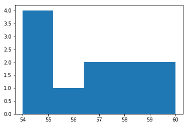

# Measures of Central Tendency
### SWBATs
* Understand and describe the significance of measuring central tendency of continuous data
* Understand the formula and intuition behind the mean, median, mode and modal class
* Compare mean-median-mode, along with histograms to explain the central tendency of given data

### Introduction and Background


When we are work with a small set of data values, it is often possible to discuss these values individually. However when we are dealing or working with large sets of data in real world problems, we prefer to have some features that can summarize and represent the data in a concise format.

In this lesson, we shall look at such measures first for a single data variable. e.g.,  the salary of workers in a particular factory. These measures will include measures of central tendency and measures of dispersion (in the following lesson). 

The term *Central Tendency* or a *Measure of central tendency* is the **typical** or **central** value for a data distribution. It is also commonly known as just the *Centre* the distribution. 

> **A measure of Central Tendency points the data scientist towards a centralized, repeated or average value**

In data analysis, central tendency is commonly used as a summary measure that attempts to describe a whole set of data with a single value to represents the centre of its distribution.

There are three main measures of central tendency: the mean, the median and the mode. Each of these measures describes a different way of indicating the typical or central value in the data as we shall wee below. 


### Mean

**Mean** or **Arithmatic Average** is the value obtained by dividing the sum of all the data by the total number of data points as shown in the formula below:


The mean value, shown as $\bar{x}$ (x-bar) for a vector $X$ is achieved by adding together all values of $X$ (shown as as $\sum{X}$),  and dividing $N$ (Number of observations).
e.g. Let’s look at a very simple set of data representing the retirement age of 11 individuals
```
54, 54, 54, 55, 56, 57, 57, 58, 58, 60, 60
```

The mean value is calculated as The mean is calculated as: 
1.  Adding together all the values 
```
54+54+54+55+56+57+57+58+58+60+60 = 623 
```
2. Dividing by the numbers of observations
```
623/11 = 56.6
```

### Median

Median, in addition to mean is another measure of central tendency which refers to the data situated at exactly the middle location of the distribution.

In a set with odd number of data points the median is exactly the middle value. In our retirement data above, as we have 11 values, we can pick the 6th value (57) to be our median.

If the number of data points is even then the median is the average of the two middle items. Let's look at this dataset for average weight of 10 individuals:
```
55, 56, 56, 58, 60, 61, 63, 64, 70, 78
```

So here, for the even number of observations (i.e. 10), the median would be calculated as:
```
Median = (60 + 61)/2 = 60.5
```

### Mode

A Mode refers the data value that occurs most frequently in a given data set. Hence, it uses the frequency (repetition) of a certain value to be a representative of central tendency of data. 

For our retirement data above, we can see that the value 54 appears most frequently (i.e. 3 times). So the mode value for retirement age , based on our data , would be 54 years. Similarly for the weight data, the value 56 appears more frequently than the rest and hence would be considered a mode for this data.  

If two (or more) values occur with the same frequency in a dataset, both (or all) of the items are considered the mode of the data and the data set is **multimodal**. (Multimodality and its impact data analysis will be discussed later in the course.)


### Histograms 

We have already seen how to draw histograms for a given set of values. Histograms can also be used as an additional aid to help decide between different measures of central tendency. 

>A histogram is a type of graph in which the x-axis lists categories or values for a data set, and the y-axis shows a count of the number of cases falling into each category.

For the sample data above, let's draw histogram for retirement ages


```python
import matplotlib.pyplot as plt
x = [54, 54, 54, 55, 56, 57, 57, 58, 58, 60, 60]
plt.hist(x, bins=5)
plt.show()
```





Here we can see that the we can see that mean value i.e. 56.6 do not fully reflect the typical behavior of this particular data if we wanted to use this as a representative figure for retirement age. The median i.e. 57 also fails to represent the general tendency found in this dataset. The mode, i.e. 54 shows the most frequency value which could be used as a representative value. Such decisions, however, are subjective and may differ based on the analytical question asked. For this example, average or median may still be used to reflect the overall range of values present in the dataset. 

Try putting in the values for weight dataset and see what you think of the histogram. Also try changing the bin size and see if it helps you better understand the distribution of underlying data.  

### Summary

In this lesson, we looked at the measures used for identifying the central tendency of a given dataset. These measures will be used throughout our data analysis journey and with practice, we shall learn to see how we can choose one (or more) of these measures to represent datasets with a multitude of distributions. 
